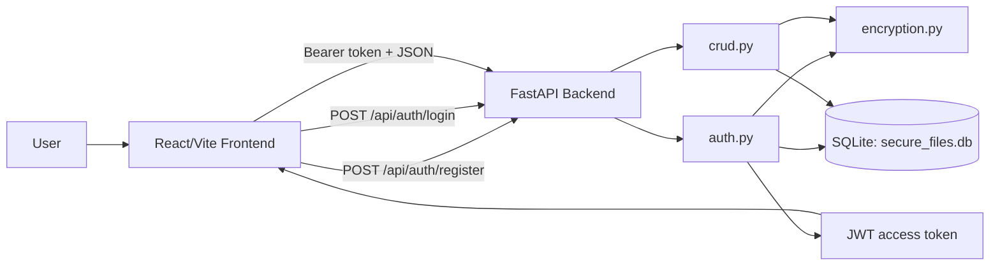
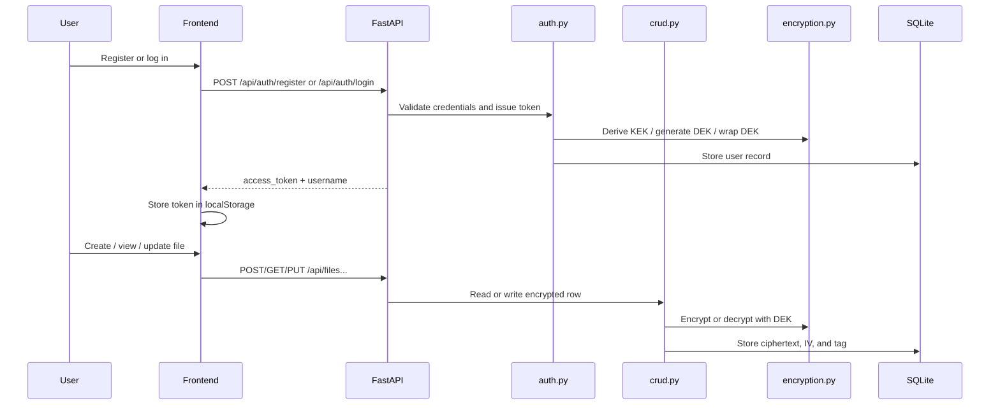

# SecureVault Project Report

This report describes the overall system design, the FastAPI endpoints, the database tables, and a practical way to demonstrate that file data is stored encrypted in the database.

## 1. High-Level Design

SecureVault is built around four layers:

- authentication and session handling in `auth.py`
- file encryption and decryption in `encryption.py`
- database operations in `crud.py`
- API exposure in `backend/main.py`

The important design idea is that plaintext file content is never written directly to the database. Instead, the application encrypts file content with a Data Encryption Key (DEK), stores the encrypted bytes, and later decrypts them only after the user has authenticated.

## 1.1 System Design Diagram





## 2. API Surface

The FastAPI backend exposes the following endpoints.

### Health

`GET /api/health`

Returns a simple status check.

Example:

```bash
curl http://localhost:8000/api/health
```

### Authentication

`POST /api/auth/register`

Creates a new user, hashes the password, derives a KEK, generates a DEK, wraps the DEK, and stores the user record.

Example:

```bash
curl -X POST http://localhost:8000/api/auth/register \
  -H 'Content-Type: application/json' \
  -d '{"username":"alice","password":"strong-password"}'
```

`POST /api/auth/login`

Verifies the password, unwraps the DEK, and returns a JWT access token.

Example:

```bash
curl -X POST http://localhost:8000/api/auth/login \
  -H 'Content-Type: application/json' \
  -d '{"username":"alice","password":"strong-password"}'
```

The response includes `access_token` and `username`. The frontend stores this token in `localStorage` and sends it as a Bearer token on later requests.

### File Operations

All file endpoints require authentication.

`GET /api/files`

Lists the user’s files.

Example:

```bash
curl http://localhost:8000/api/files \
  -H "Authorization: Bearer $TOKEN"
```

`POST /api/files`

Creates a new file. The server encrypts the content before saving it.

Example:

```bash
curl -X POST http://localhost:8000/api/files \
  -H "Authorization: Bearer $TOKEN" \
  -H 'Content-Type: application/json' \
  -d '{"filename":"notes.txt","content":"This is secret text"}'
```

`GET /api/files/{filename}`

Returns the decrypted file content for the authenticated user.

Example:

```bash
curl http://localhost:8000/api/files/notes.txt \
  -H "Authorization: Bearer $TOKEN"
```

`GET /api/files/{filename}/encrypted`

Returns the encrypted database values for the file: ciphertext, IV, and tag.

Example:

```bash
curl http://localhost:8000/api/files/notes.txt/encrypted \
  -H "Authorization: Bearer $TOKEN"
```

`PUT /api/files/{filename}`

Replaces the file content and re-encrypts it with the same DEK.

Example:

```bash
curl -X PUT http://localhost:8000/api/files/notes.txt \
  -H "Authorization: Bearer $TOKEN" \
  -H 'Content-Type: application/json' \
  -d '{"content":"Updated secret text"}'
```

`DELETE /api/files/{filename}`

Deletes the file row from the database.

Example:

```bash
curl -X DELETE http://localhost:8000/api/files/notes.txt \
  -H "Authorization: Bearer $TOKEN"
```

## 3. How the API Uses Encryption

The flow is:

1. a user registers
2. the app hashes the password with Argon2id
3. the app derives a KEK from the password and a random salt
4. the app generates a random DEK
5. the app wraps the DEK with the KEK and stores it in the `users` table
6. the user logs in and the server unwraps the DEK
7. the DEK is placed into the JWT payload
8. file content is encrypted and decrypted with that DEK

This means the file rows in the database are not stored as plaintext. They are stored as AES-GCM ciphertext plus the IV and authentication tag.

## 4. Database Tables

The database is a SQLite file named `secure_files.db`.

### `users`

Defined in `model.py` as `User`.

Columns:

- `id`: primary key string
- `username`: unique username
- `password_hash`: Argon2id password hash
- `kek_salt`: random salt used to derive the KEK
- `wrapped_dek`: the DEK encrypted with the KEK
- `created_at`: creation timestamp

This table stores authentication and key-wrapping material, not file contents.

### `encrypted_files`

Defined in `model.py` as `EncryptedFile`.

Columns:

- `id`: primary key string
- `owner_id`: foreign key to `users.id`
- `filename`: logical file name
- `ciphertext`: AES-GCM encrypted file bytes
- `iv`: initialization vector used for encryption
- `tag`: AES-GCM authentication tag
- `created_at`: creation timestamp
- `updated_at`: last update timestamp

This table stores the encrypted file payload.

### Relationship

One user can own many encrypted files. The `EncryptedFile.owner_id` column links each file row back to the owning user.

## 5. How to Demonstrate That Stored Files Are Encrypted

There are two good demonstrations: one through FastAPI and one directly through SQLite.

### A. Demonstrate Through FastAPI

1. Start the backend.
2. Register a user.
3. Log in and save the returned token.
4. Create a file with a plain English sentence.
5. Call `GET /api/files/{filename}/encrypted`.

You should see base64-encoded `ciphertext`, `iv`, and `tag`, not the original plaintext.

Example response shape:

```json
{
  "filename": "notes.txt",
  "ciphertext": "...",
  "iv": "...",
  "tag": "...",
  "created_at": "...",
  "updated_at": "..."
}
```

Then call `GET /api/files/{filename}`. That endpoint returns the decrypted plaintext only because the server still has the DEK from the authenticated token.

The contrast between those two endpoints is the cleanest API-level proof that the stored data is encrypted at rest.

### B. Demonstrate Through SQLite

Because the database is SQLite, you can inspect the stored row directly.

Use the schema command:

```bash
sqlite3 secure_files.db ".schema users"
sqlite3 secure_files.db ".schema encrypted_files"
```

Then inspect the file rows:

```bash
sqlite3 secure_files.db "SELECT filename, hex(ciphertext), hex(iv), hex(tag) FROM encrypted_files;"
```

What you should observe:

- `ciphertext` is binary data, not readable text
- `iv` is a short random binary value
- `tag` is authentication data, not plaintext

If the file content were stored directly, the row would contain the sentence in readable form. Instead, the stored bytes are opaque and only become readable after decryption with the correct DEK.

## 6. Suggested Demo Script

If you want to present the system live, this sequence works well:

1. `POST /api/auth/register`
2. `POST /api/auth/login`
3. `POST /api/files` with a human-readable message
4. `GET /api/files/{filename}/encrypted` to show ciphertext, IV, and tag
5. `sqlite3 secure_files.db "SELECT filename, hex(ciphertext) FROM encrypted_files;"` to show the database stores encrypted bytes
6. `GET /api/files/{filename}` to show the app can still recover the original text when authenticated

That sequence demonstrates both confidentiality and usability.

## 6. Attack Vectors and Security Analysis

This project is a good example of a secure-by-design prototype, but it still has a real attack surface. The most relevant threats are below.

### Brute-force password attacks

An attacker may try many password guesses against the login endpoint.

Mitigations:

- passwords are hashed with Argon2id
- registration requires passwords to be at least 8 characters long
- login responses do not reveal whether the username or password was wrong

Residual risk:

- there is no rate limiting or account lockout yet

### Token theft and session hijacking

The JWT is stored in `localStorage`, so malicious JavaScript in the page could steal it.

Mitigations:

- the token is required for all protected API calls
- the token expires after one hour

Residual risk:

- a stolen token also exposes the DEK inside the JWT payload until expiration

### JWT tampering

An attacker may try to modify the token and impersonate another user.

Mitigations:

- the backend verifies the JWT signature
- invalid or expired tokens are rejected

### Ciphertext tampering

An attacker with database access may try to alter encrypted file data.

Mitigations:

- AES-GCM provides authenticated encryption
- tampering causes decryption failure

### SQL injection

Database-backed applications often fail if they build raw SQL from user input.

Mitigations:

- the project uses SQLAlchemy ORM filters
- input is validated by FastAPI and Pydantic models

### Unauthorized file access

An attacker may guess a filename and try to access another user’s file.

Mitigations:

- file queries always include both `owner_id` and `filename`
- the backend only returns records owned by the authenticated user

### Secret exposure in source code

The JWT secret is hardcoded in `auth.py` in the current class-project version.

Risk:

- if the source code is exposed, token forgery becomes possible

Recommended improvement:

- move secrets to environment variables before production use

### Path traversal

This project stores filenames in the database rather than writing them to the filesystem.

Why that matters:

- filenames are logical labels, not filesystem paths
- there is no direct path traversal target in the current design

## 7. Summary

The system design is simple but effective:

- authentication is handled with Argon2id and JWTs
- file content is encrypted with AES-256-GCM
- the database stores only encrypted file bytes, IVs, and tags
- the FastAPI endpoint `/api/files/{filename}/encrypted` exposes the encrypted payload for verification
- SQLite inspection shows the stored file rows are not plaintext

From a broader security perspective, SecureVault demonstrates the full lifecycle of a secure vault application:

- registration creates both authentication material and key-wrapping material
- login proves password knowledge and returns an authenticated token
- the token is used to authorize file operations
- the DEK is used to encrypt and decrypt file content
- the database stores ciphertext rather than readable file text

This makes the security story easy to explain and easy to demonstrate, while still leaving room for realistic improvements such as rate limiting, secret management, and stronger browser-side token handling.